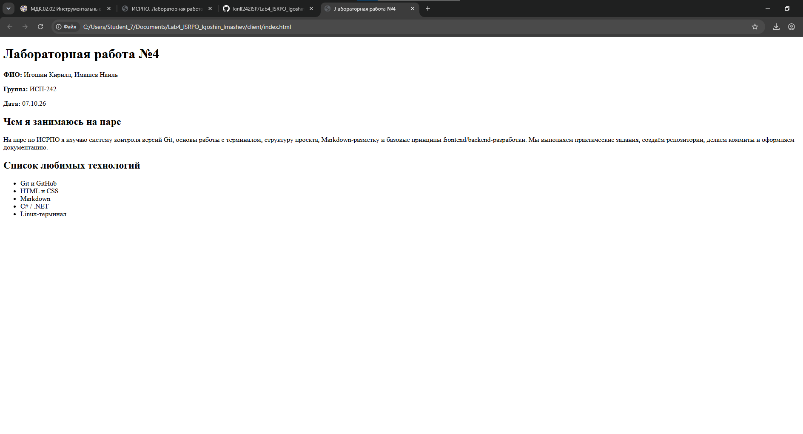

browser_Igoshin_Imasev.png# Заголовок H1

## Заголовок H2

### Заголовок H3

#### Заголовок H4

##### Заголовок H5

###### Заголовок H6

---

**Жирный текст**

*Курсив*

~~Зачёркнутый текст~~

`Моноширный текст`

---

## Списки

### Маркированный список

- Первый пункт
- Второй пункт
- Третий пункт

### Нумерованный список

1. Первый пункт
2. Второй пункт
3. Третий пункт

### Вложенный список

- Основной пункт
  - Вложенный пункт
    - Ещё более вложенный пункт

---

## Цитата

> Пример цитаты

---

## Блок кода

```bash
git status
```

---

## Таблица


| Столбец 1   | Столбец 2   | Столбец 3   |
| ------------------ | ------------------ | ------------------ |
| Значение 1 | Значение 2 | Значение 3 |
| Значение 4 | Значение 5 | Значение 6 |
| Значение 7 | Значение 8 | Значение 9 |

---

## Картинка



---

## Ссылки

- [Внешняя ссылка — GitHub](https://github.com)
- [Внутренняя ссылка — README](../README.md)

---

## Чекбоксы

- [X]  Сделано
- [X]  Не сделано

---

## Alert-блок GitHub

> [!NOTE]
> Пример alert-блока GitHub

---

## Inline LaTeX

Формула Пифагора: $a^2 + b^2 = c^2$

---

## Block LaTeX

$$
\sum_{i=1}^n i = \frac{n(n+1)}{2}
$$
